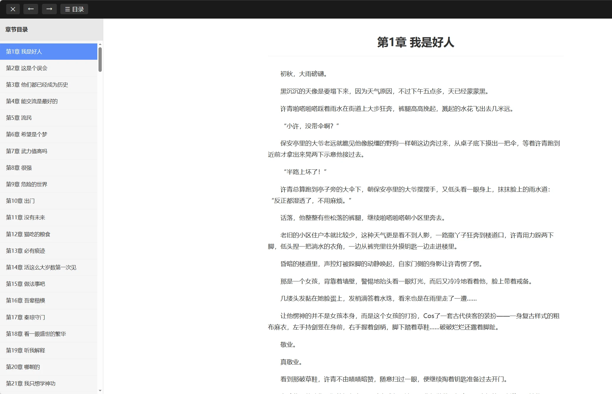

# hexo-readers

A collection of Hexo tag plugins for inline file cards with browser-based reading.

Each format has its own standalone `*-reader.js` — copy only what you need.

*(Current release: UI in Simplified Chinese — edit the corresponding `*-reader.js` directly for English or other languages.)*

## Included Readers

| Format | File | Tag | Description |
|--------|------|-----|-------------|
| **EPUB** | `epub-reader.js` | `` | Per-volume cards with cover, online EPUB reader (epub.js), and download fallback |
| **TXT / Markdown** | `txt-reader.js` | `` | Auto-split chapter cards by `###` headings, built-in reader with TOC sidebar |
| **PDF** *(planned)* | `pdf-reader.js` | `` | Inline PDF cards with browser viewer *(coming soon)* |
| **Word** *(planned)* | `word-reader.js` | `` | DOCX cards with preview *(coming soon)* |

## Install

Copy the `*-reader.js` files you need into your Hexo tag scripts directory:

```bash
# NexT theme
themes/next/scripts/tags/

# Or blog root
scripts/tags/
```

> **Note:** Each file is self-contained. You only need to copy the formats you actually use. Multiple readers can coexist without conflict.

---

## EPUB Reader

### Features

- `` tag for per-volume cards (cover, title, release date, volume badge)
- Browser-based EPUB reading via [epub.js](https://github.com/futurepress/epub.js) + JSZip
- Auto path resolution for `post_asset_folder` + `abbrlink`
- Chinese filename support, image blob fallback, Sony `res://` font override
- Graceful download fallback when online rendering fails
- Responsive grid layout
- Keyboard shortcuts: `←` / `→` to flip pages, `Esc` to close

### Usage

```markdown
<div class="epub-grid">



</div>
```

### Preview

**Volume Cards：**


**Reader Interface：**


### Parameters

| Param | Required | Description |
|-------|----------|-------------|
| `path` | ✅ | EPUB file path (relative to post asset folder or absolute) |
| `title` | — | Volume title shown on card |
| `cover` | — | Cover image path |
| `volume` | — | Volume number badge (e.g. `1`) |
| `date` | — | Release date string |

---

## TXT / Markdown Reader

### Features

- `` block tag: wrap `###` headings and body text to auto-generate chapter cards
- One card per `h3` chapter, with title and read button
- Built-in modal reader with TOC sidebar, prev/next chapter navigation
- Keyboard shortcuts: `←` / `→` to switch chapters, `Esc` to close
- Responsive grid layout; mobile-friendly TOC drawer

### Usage

```markdown


### Ch.1

content 1

### Ch.2

content 2


```

### Preview

**Chapter Cards：**


**Reader View：**



### How it works

The plugin renders the inner Markdown first, then splits content by `<h3>` tags. Each `###` heading becomes an independent chapter card. Click `📖 阅读` to open the reader.

---

## Roadmap

- [ ] **PDF Reader** — Inline PDF viewer with page navigation
- [ ] **Word Reader** — DOCX preview with text extraction
- [ ] **MOBI / AZW3 Reader** — Kindle format support

Feel free to open an issue or PR if you want a new format supported.
